<!-- regular html comment --> 

# Lesson 5: 

## Contents

### **The transfer function of the free cantilever**

- The distortion of the resonant frequency curve 

### **Linear and Non Linear response**

- What is the resonant frequency?

### **The transfer fucntion of the interacting cantilever** 

### **The attractive to repulsive transitions**

## The equation of motion

 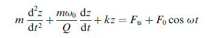

## The transfer function (Linear system)

 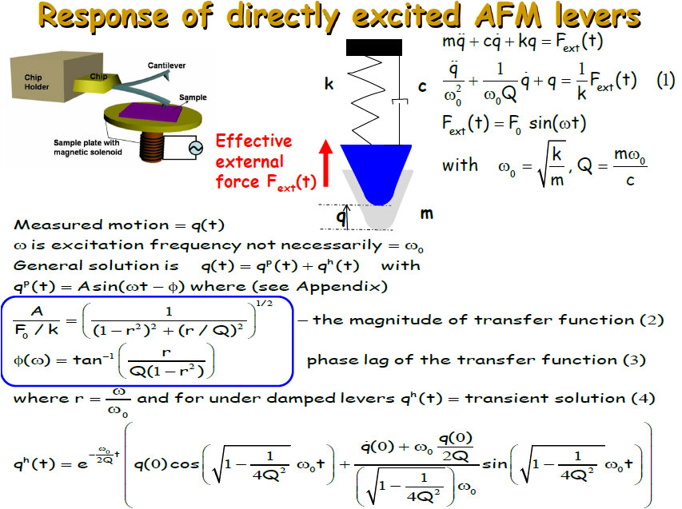 
 
 
Ref: Reifenberger, R. & Raman, A. Fundamentals of Atomic Force Microscopy: Part 2: Dynamic AFM Methods (Fall 2012). https://nanohub.org/resources/9598 (2012).

## The non-linear system

- The resonant frequency and distortion

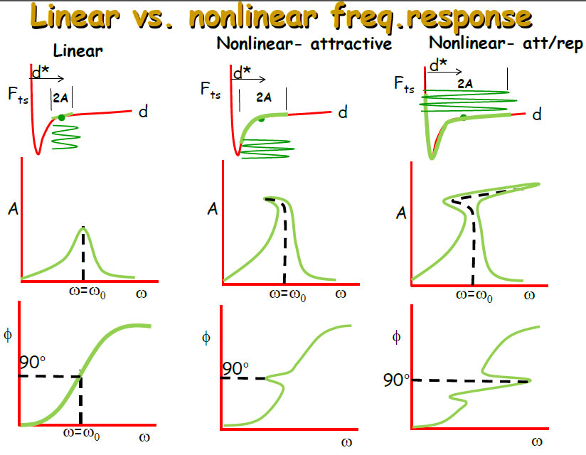 

## The transfer function of the interacting system

- What affects the amplitude decay?

- Question: In the linear system?

- Question: In the non-linear system?

## Conservative and issipative forces

- The forces!

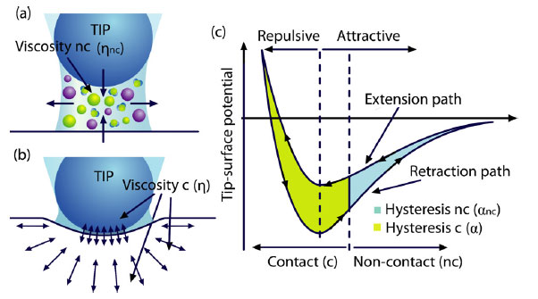 

Ref: S. Santos, V. Barcons, A. Verdaguer, J. Font, N. H. Thomson and M. Chiesa, Nanotechnology 22 (34), 345401 (2011).

## The transfer function and forces

- Conservative and dissipative forces

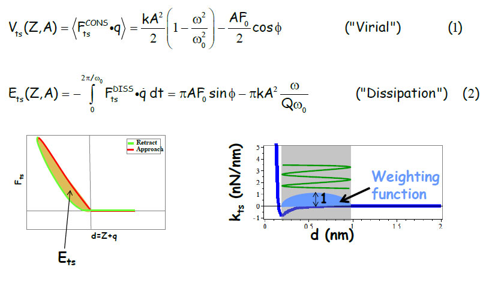 

## The transfer function of the interacting system

- The amplitude decay and phase response 

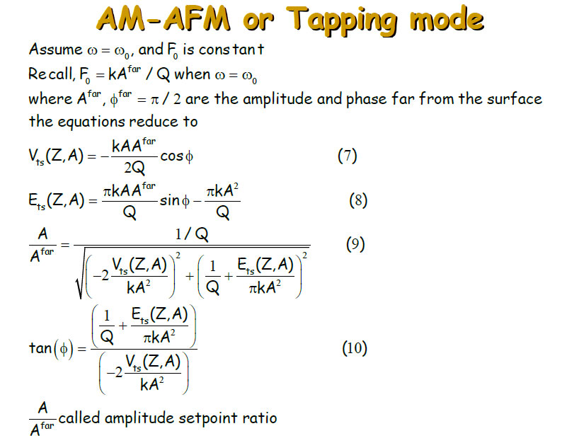 

## The energy stored in the non-linear system

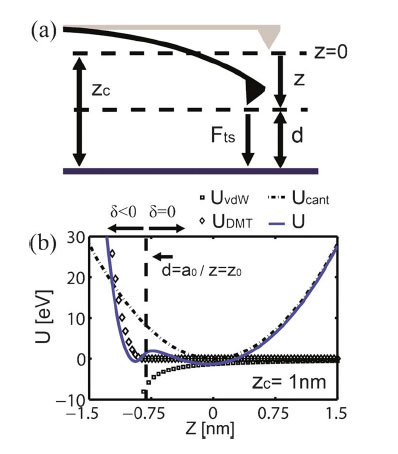 

## Experimental amplitude decay and phase response

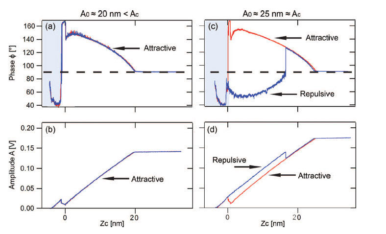 

Ref: S. Santos, K. R. Gadelrab, T. Souier, M. Stefancich and M. Chiesa, Nanoscale 4 (3), 792-800 (2012).

## Non linearities and imaging 

- Effects of set-point

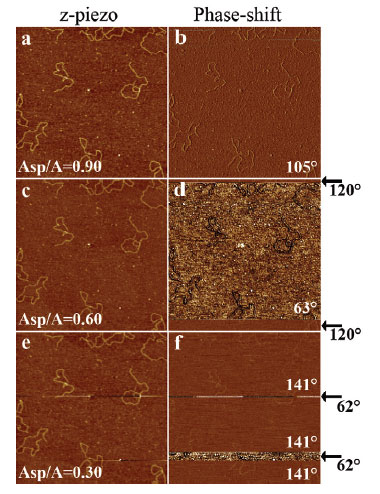 

Ref: S. Santos, V. Barcons, J. Font and N. H. Thomson, Nanotechnology 21 (22), 225710 (2010).

## Non linearities and imaging 

- Effects of free amplitude

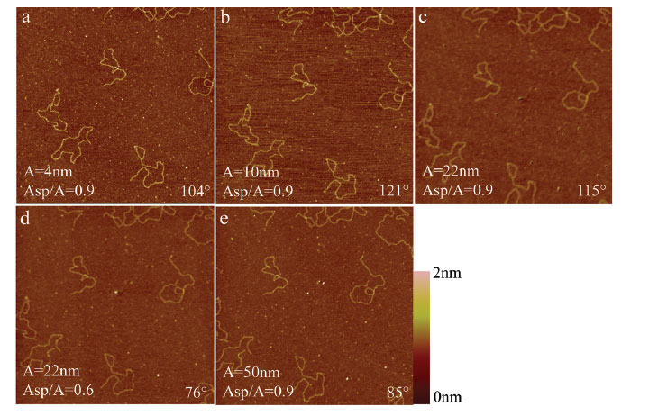 

## The concept of critical amplitude?

- There is a region where bistability is observed!

 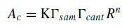
 
 Ref: S. Santos, L. Guang, T. Souier, K. R. Gadelrab, M. Chiesa and N. H. Thomson, Review of Scientific Instruments 83, 043707-043717 (2012).
 

## The concept of critical amplitude?

- Simulations and dependencies on cantilever

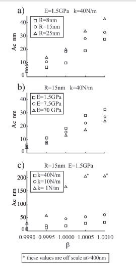 

## The concept of critical amplitude?

- Simulations and dependencies on sample properties

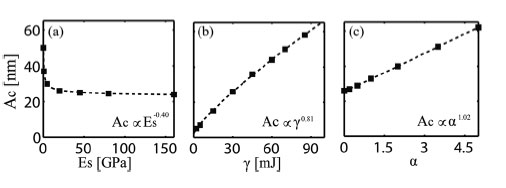 
 

----

- Project 4:

Noise and the interacting, i.e. constrained, system. 

Find it [here](https://github.com/AdvancedForcesGroup/Projects4)

There is some ["homework"](https://github.com/AdvancedForcesGroup/Projects4/blob/master/Homework_Project4.Rmd)

and simple explanation [here](https://github.com/AdvancedForcesGroup/Projects4/blob/master/Project4.pdf)

----

- Questions?

